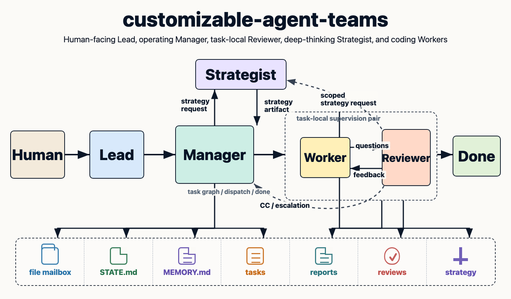

# customizable-agent-teams

ローカルの tmux 上で、Claude Code / Codex などの coding agent を **Lead / Manager / Strategist / Architect / Release Captain / Reviewer / Worker** のチームとして動かすためのプロジェクトテンプレートです。

人間は Lead にだけ話します。Lead は曖昧な依頼を丁寧に擦り合わせ、Manager が task 分解と進行管理を持ち、Worker と Reviewer がペアで実装を進めます。Strategist は深い調査、Architect は技術方針、Release Captain は完了前の全体確認を担当します。



## 特徴

- **Lead は人間との共同思考に集中** — Lead は実装も dispatch もせず、質問、承認取得、意図の翻訳に専念します。
- **Manager がチーム運用を所有** — task 作成、worker/reviewer 割当、dispatch、escalation、done 判定、release bundle 作成、`STATE.md` 更新を担当します。
- **Strategist を常駐** — 深い bug 調査、比較、実行計画を成果物として残します。
- **Architect が技術方針を所有** — 抽象化、境界、テスト方針、統合時の一貫性を見ます。
- **Release Captain が全体確認** — task 単位の OK とは別に、bundle が人間へ完了報告できる状態かを判定します。
- **Reviewer が task-local supervisor** — 常駐 reviewer が worker の相談窓口になり、途中 feedback、strategy 相談、final review を担当します。
- **shared root** — 全 agent が同じ repo root で動きます。venv / node_modules / `.env` / direnv を重複させません。
- **CLI / model の混在** — `.agents/config/agent-team.yaml` で役割ごとに CLI・model・起動コマンドを変更できます。

## 仕組み

| 役割 | 配置 | 責務 |
| --- | --- | --- |
| **Lead** | tmux `lead` pane | 人間の唯一の窓口。曖昧な依頼を擦り合わせ、必要な判断を人間に確認し、Manager に依頼する。project code は編集しない。 |
| **Manager** | tmux `manager` pane | task 分解、worker/reviewer 割当、dispatch、escalation 対応、done 判定、release bundle 作成、`.agents/state/STATE.md` の主編集者。project code は編集しない。 |
| **Strategist** | tmux `strategist` pane | 深い調査、複数案比較、実行計画。 |
| **Architect** | tmux `architect` pane | 技術方針、設計一貫性、境界、テスト期待値を判断する。 |
| **Release Captain** | tmux `release-captain` pane | 複数 task のまとまりを確認し、`SHIP` / `FIX` / `BLOCKED` を返す。 |
| **Reviewer** | tmux `reviewer-N` pane | worker の task-local supervisor。質問受付、途中 feedback、strategy 相談、final review を担当する。project code は編集しない。 |
| **Worker** | tmux `worker-N` pane | shared root で実装、検証、commit、report を担当する。 |

```text
Human
  -> Lead
  -> Manager
  -> Worker + Reviewer pair
  -> Strategist / Architect when deeper thinking is needed
  -> Reviewer OK/FIX/ASK_MANAGER
  -> Manager marks done
  -> Release Captain SHIP/FIX/BLOCKED
  -> Lead reports completion
```

Escalation は狭い範囲で決められる role から順に上がります。

```text
Worker -> Reviewer -> Manager -> Lead -> Human
Reviewer / Manager / Lead -> Architect
Reviewer / Manager / Architect / Lead -> Strategist
Release Captain -> Architect
```

## 必要なツール

チームの起動には `git` `make` `bash` `tmux` `direnv` と、使う coding agent の CLI（`claude` / `codex` など）が必要です。GitHub 操作は `gh` を使います。

日常の repo 調査には `ripgrep` `fd` `bat` `git-delta` があると便利です。選んだ stack の toolchain（例: Python なら `uv`、TypeScript なら `pnpm` / `node`）も bootstrap で使います。

<details>
<summary>macOS でまとめてインストール</summary>

```bash
brew install gh ripgrep fd bat git-delta direnv tmux pnpm node python uv
brew install --cask codex
npm install -g @anthropic-ai/claude-code
```

</details>

<details>
<summary>Linux（apt 系）でまとめてインストール</summary>

```bash
npm install -g @openai/codex @anthropic-ai/claude-code
wget -qO- https://get.pnpm.io/install.sh | sh -
wget -qO- https://astral.sh/uv/install.sh | sh

type -p wget >/dev/null || (sudo apt update && sudo apt install -y wget)
sudo mkdir -p -m 755 /etc/apt/keyrings
out=$(mktemp) && wget -nv -O"$out" https://cli.github.com/packages/githubcli-archive-keyring.gpg
cat "$out" | sudo tee /etc/apt/keyrings/githubcli-archive-keyring.gpg > /dev/null
sudo chmod go+r /etc/apt/keyrings/githubcli-archive-keyring.gpg
sudo mkdir -p -m 755 /etc/apt/sources.list.d
echo "deb [arch=$(dpkg --print-architecture) signed-by=/etc/apt/keyrings/githubcli-archive-keyring.gpg] https://cli.github.com/packages stable main" | sudo tee /etc/apt/sources.list.d/github-cli.list > /dev/null
sudo apt update
sudo apt-get install -y gh ripgrep fd-find bat direnv tmux python3 nodejs npm
command -v fd >/dev/null || sudo ln -s /usr/bin/fdfind /usr/local/bin/fd
command -v bat >/dev/null || sudo ln -s /usr/bin/batcat /usr/local/bin/bat
```

</details>

## Quick Start

1. このテンプレートから新しい repo を作り、clone する。

2. 現在の shell で `direnv` を有効にする。

   <details>
   <summary>direnv フックを shell に追加する（未設定の場合）</summary>

   ```bash
   if [ -n "${ZSH_VERSION:-}" ]; then
     rc="$HOME/.zshrc"; hook='eval "$(direnv hook zsh)"'
   elif [ -n "${BASH_VERSION:-}" ]; then
     rc="$HOME/.bashrc"; hook='eval "$(direnv hook bash)"'
   else
     echo "Add the direnv hook for your shell, then rerun Quick Start." >&2; exit 1
   fi
   eval "$hook"
   grep -Fqx "$hook" "$rc" 2>/dev/null || printf '\n%s\n' "$hook" >> "$rc"
   ```

   </details>

3. bootstrap を開始する。

   ```bash
   make bootstrap
   ```

   attach すると `lead` pane が「何を作るか」を最初の 1 問として聞いてきます。Lead は一度に質問を並べず、回答ごとに作るもの・stack・entrypoint・`make post-change`・`make smoke` を狭めます。

4. Lead が bootstrap 方針を固め、Manager に初期化依頼を送ったら、tmux から detach（`Ctrl-b` のあと `d`）し、repo root で次を実行する。

   ```bash
   make bootstrap-team
   ```

   既存の Lead pane はそのまま、残りの role が起動します。以降は Lead pane で進行を見守り、Lead から質問されたときだけ答えます。

## チームの設定

`.agents/config/agent-team.yaml` で役割・model・CLI・起動コマンド・agent 数を変更できます。

- `team.lead` — Lead の CLI / model / window / command
- `team.manager` — Manager の CLI / model / window / command
- `team.strategist` — Strategist の CLI / model / window / command
- `team.architect` — Architect の CLI / model / window / command
- `team.release-captain` — Release Captain の CLI / model / window / command
- `team.reviewers` — Reviewer pool
- `team.workers` — Worker pool

## 日常運用

| 操作 | コマンド | 主に使う役割 |
| --- | --- | --- |
| チーム起動 / 再起動 | `make team-start` → `tmux attach -t agent-team` | 人間 |
| 状態確認 | `make team-status` / `make state` | Manager / Lead |
| inbox 確認 | `make inbox AGENT=worker-1` | 全員 |
| 未送信プロンプトの送信 | `make team-submit AGENT=worker-1` | 全員 |
| agent 連絡 | `make team-send FROM=lead TO=manager TYPE=intake TASK=- BODY="..."` | 全員 |
| 長文の agent 連絡 | `make team-send FROM=lead TO=manager TYPE=intake TASK=- BODY_FILE=/tmp/message.md` | 全員 |
| task dispatch | `make dispatch TASK=T-001 WORKER=worker-1 REVIEWER=reviewer-1` | Manager |
| 検証ゲート | `make post-change` / `make smoke` | Worker |
| reviewer feedback | `make team-send FROM=reviewer-1 TO=worker-1 TYPE=review_feedback TASK=T-001 BODY="..."` | Reviewer |
| strategist 相談 | `make team-send FROM=reviewer-1 TO=strategist TASK=T-001 BODY="..."` | Lead / Manager / Reviewer |
| architect 相談 | `make team-send FROM=reviewer-1 TO=architect TASK=T-001 BODY="..."` | Lead / Manager / Reviewer / Release Captain |
| worker report | `make report TASK=T-001 AGENT=worker-1 STATUS=needs_review` | Worker |
| reviewer decision | `make review-report TASK=T-001 REVIEWER=reviewer-1 DECISION=OK` | Reviewer |
| done 更新 | `make state-update TASK=T-001 STATUS=done` | Manager |
| release review 依頼 | `make release-request BUNDLE=R-001 TASKS="T-001 T-002"` | Manager |
| release decision | `make release-report BUNDLE=R-001 RELEASE_CAPTAIN=release-captain DECISION=SHIP` | Release Captain |
| 完了報告準備 | `make team-send FROM=manager TO=lead TYPE=completion_ready BODY="..."` | Manager |
| 停止 | `make team-stop` | 人間 |

team pane の中では `TEAM_AGENT_ID` が sender になります。repo shell から直接送る場合は `FROM=<agent_id>` を指定します。
repo shell から直接 dispatch する場合は `MANAGER=<manager_id>` も指定します。

## Repository Layout

| パス | 内容 |
| --- | --- |
| `AGENTS.md` | 全 agent 共通の作業ルール（`CLAUDE.md` は symlink） |
| `.agents/config/agent-team.yaml` | 役割・model・起動コマンド設定 |
| `.agents/agent-team.mk` | agent team 操作用の Make targets |
| `.agents/harness.mk` | このテンプレート自体の保守用 test target |
| `.agents/docs/TEAM_PROTOCOL.md` | agent team の手順 |
| `.agents/state/STATE.md` | 現在の whole picture |
| `.agents/state/MEMORY.md` | 中長期の rules / tips / pitfalls / user preferences |
| `.agents/skills/` | Claude Code / Codex 共通の skill（`.claude/skills`・`.codex/skills` は symlink） |
| `.agents/scripts/` | 各コマンドの実体 |
| `.agents/queue/` | tasks / inbox / reports / reviews / strategy / architecture / releases / proposals / state |
| `.agents/tests/team/` | このテンプレート自体の test |
| `Makefile` | project の `post-change` / `smoke` と `.agents/agent-team.mk` の import |

## ドキュメント

- [`AGENTS.md`](AGENTS.md) — 役割ごとの作業ルール
- [`.agents/docs/TEAM_PROTOCOL.md`](.agents/docs/TEAM_PROTOCOL.md) — task / review / state の詳細
- [`.agents/state/MEMORY.md`](.agents/state/MEMORY.md) — 共有 memory のルール
